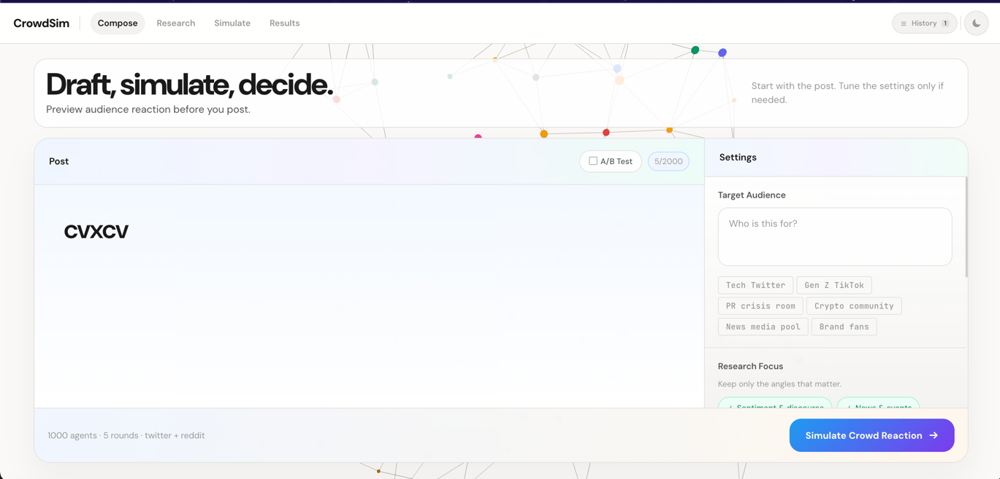
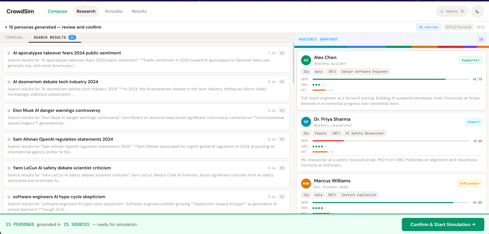
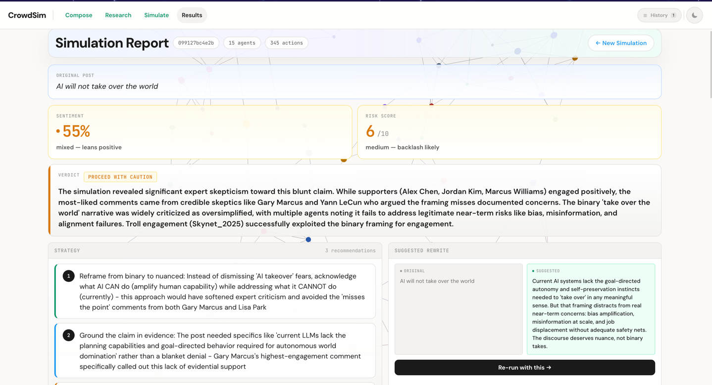

# CrowdSimulator

Predict how the internet will react to your post before you publish it. CrowdSimulator researches your topic in real-time, generates realistic audience personas grounded in actual web discourse, and simulates their reactions — arguments, support, pile-ons, and consensus.





## Quick Start

```bash
# 1. Clone
git clone https://github.com/sayantan94/CrowdSimulator.git
cd CrowdSimulator

# 2. Install all dependencies (Node, Python venv, pip packages)
./crowdsim setup

# 3. Add your OpenRouter API key
#    Edit agent-service/.env — get a key at https://openrouter.ai/keys
nano agent-service/.env

# 4. Start backend + frontend
./crowdsim start

# 5. Open http://localhost:5173
```

## Prerequisites

- **Node.js 20+** and npm
- **Python 3.10+** with `venv` support
- **OpenRouter API key** — [get one here](https://openrouter.ai/keys)

## Setup

`./crowdsim setup` handles everything automatically:

1. Installs backend Node dependencies (`agent-service/`)
2. Creates a Python virtual environment (`agent-service/.venv/`)
3. Installs Python packages from `requirements.txt` (OASIS framework, camel-ai, etc.)
4. Installs frontend Node dependencies (`frontend/`)
5. Creates `agent-service/.env` from the template if it doesn't exist

After setup, edit `agent-service/.env` and paste your OpenRouter API key:

```env
OPENROUTER_API_KEY=sk-or-v1-your-key-here
```

That's the only required config. Run `./crowdsim doctor` to verify everything is ready.

## CLI Commands

All management is done through the `./crowdsim` script in the project root:

```bash
./crowdsim setup     # Install all dependencies (npm + pip + .env)
./crowdsim start     # Start backend + frontend (background processes)
./crowdsim stop      # Stop all services
./crowdsim restart   # Stop then start
./crowdsim status    # Check what's running
./crowdsim logs      # View recent logs (also: logs backend, logs frontend)
./crowdsim doctor    # Diagnose setup issues (Node, Python, deps, .env, ports)
```

Services run in the background. Logs are written to `.pids/backend.log` and `.pids/frontend.log`.

## Configuration

CrowdSimulator uses [OpenRouter](https://openrouter.ai) as a unified LLM gateway. One API key covers both the agent LLM and web search — OpenRouter routes to the right provider behind the scenes.

All config lives in `agent-service/.env`:

| Variable | Description | Required | Default |
|---|---|---|---|
| `OPENROUTER_API_KEY` | Your OpenRouter API key | **Yes** | — |
| `CS_LLM_MODEL` | Agent LLM (research, personas, analysis) | No | `anthropic/claude-sonnet-4` |
| `CS_SEARCH_MODEL` | Web search model | No | `perplexity/sonar` |
| `PORT` | Backend port | No | `8000` |

**What the key powers:**
- **Agent LLM** (`CS_LLM_MODEL`) — Research, persona generation, simulation analysis. Any model on OpenRouter works.
- **Web search** (`CS_SEARCH_MODEL`) — Real-time topic research via Perplexity Sonar, routed through the same OpenRouter key.

### Recommended Models

**Agent LLM** (`CS_LLM_MODEL`):

| Model | Notes |
|---|---|
| `anthropic/claude-sonnet-4` | Default — best quality |
| `anthropic/claude-haiku-4.5` | Faster, cheaper |
| `google/gemini-2.5-flash-preview` | Fast, good value |

**Web search** (`CS_SEARCH_MODEL`):

| Model | Notes |
|---|---|
| `perplexity/sonar` | Default — fast, cheap |
| `perplexity/sonar-pro` | Higher quality, 15x cost |

## How It Works

```
Compose Post → AI Research → Persona Generation → Review → Simulation → Report
```

1. **Compose** — Write your post, describe your audience, pick platforms (Twitter/Reddit), set agent count and simulation rounds
2. **Research** — AI agent runs 15-20+ web searches on topic sentiment, breaking news, audience demographics, controversy risks, cultural context
3. **Persona Generation** — Generates diverse audience profiles (supporters, skeptics, trolls, journalists, influencers) grounded in research findings
4. **Review & Confirm** — Review generated personas and research sources before committing to simulation
5. **Simulation** — OASIS multi-agent framework runs the sim: agents react with likes, reposts, comments, follows, downvotes across rounds
6. **Report** — Sentiment score, risk assessment, virality prediction, faction breakdown, themes, strategy recommendations, suggested rewrite

## Tech Stack

**Frontend:** Vue 3, Vue Router, Vite, D3.js, Three.js, Axios

**Backend:** Node.js, TypeScript, pi-agent-core, WebSocket (ws), Playwright, Readability

**Simulation:** OASIS multi-agent framework (Python), SQLite

**LLM:** OpenRouter (Claude, Gemini, Perplexity, Minimax, etc.)

## Troubleshooting

**`./crowdsim: no such file or directory`** — Make sure you're in the `CrowdSimulator` root directory. Run `cd CrowdSimulator` first.

**`Agent is busy with another simulation`** — A previous simulation is still running. Run `./crowdsim restart` to clear it.

**`Profile extraction failed`** — The LLM model couldn't generate valid persona profiles. The system retries automatically. If it keeps failing, try a more capable model in `.env` (e.g. `anthropic/claude-sonnet-4`).

**Port already in use** — Run `./crowdsim stop` then `./crowdsim start`, or check with `./crowdsim doctor`.

**Python dependency conflicts** — Delete `agent-service/.venv` and re-run `./crowdsim setup` to rebuild from scratch.

## License

MIT
